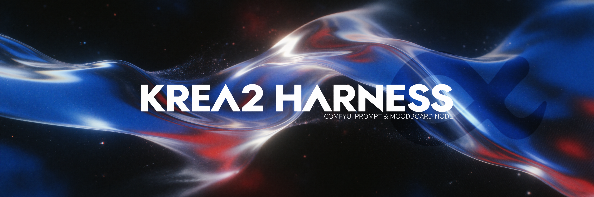
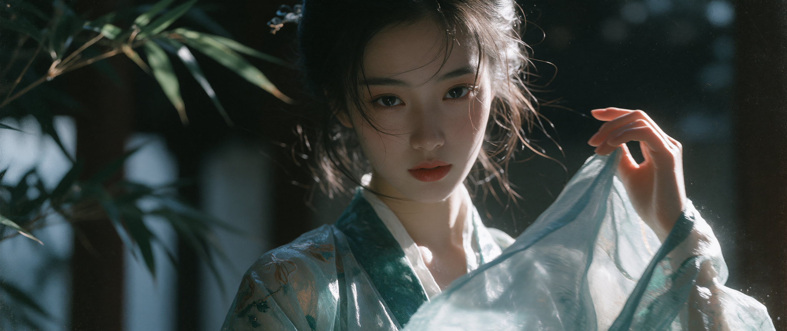
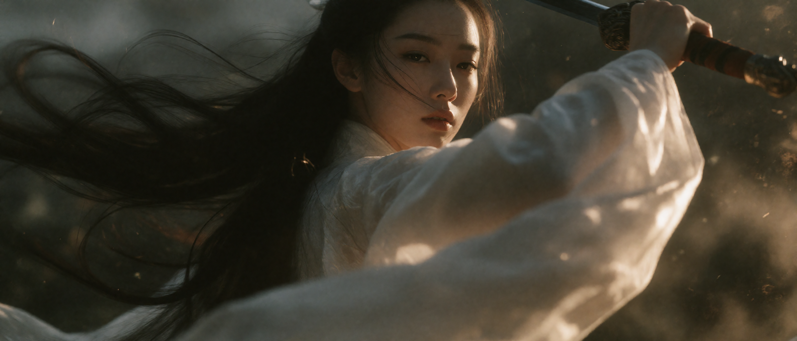
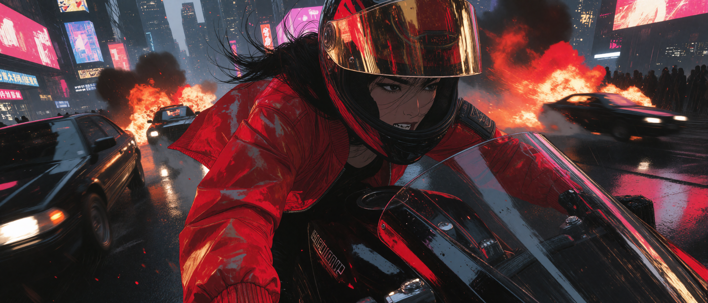
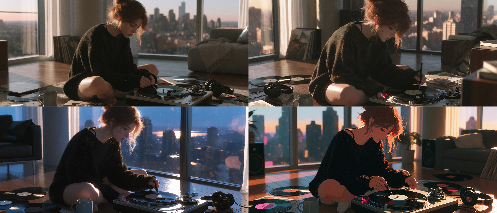

# ComfyUI-Krea-Harness
The Krea Harness Alpha for ComfyUI is currently under development. Get ready to unleash your creativity with moodboards!

ITMS-PLPT Framework (Inference-Time Model Steering with Prompt-Layer Post-Training)
A specialized inference-time model steering and prompt-layer post-training framework developed by me.

## Generated Results

**Krea harness-moodboards T2I+ M87 Lora** 

Prompt：一个性冷淡风格，纯欲面容的18岁貌美古风女性，她微笑看向镜头，手带起衣袖在风中飘动，写真，镜头低角度 （Cinematic Nocturnal Noir）
 Lora 0.8
 Lora 1.0

Prompt：一个性冷淡风格，纯欲面容的18岁貌美古风女剑仙舞剑，一身白衣，衣服头发随风飘动，超低角度仰视

Prompt：一个亚裔高级脸女性骑着摩托在赛博朋克风都市穿行，她在疯癫的大笑，正面微侧高角度俯视角色，定格在她正在超过左侧汽车的瞬间，身后远方车辆爆炸，厚涂漫画风格，复杂高密度细节笔触，鱼眼超广角 （Dynamic Ink Fantasy）
 
0.8 M87 Lora+ 1.0 realism_engine_krea2_v3.1 Lora

Prompt：一个性冷淡风格，纯欲面容的18岁貌美古风女性，她微笑看向镜头，手带起衣袖在风中飘动，写真，镜头低角度

生成为四个象限的4宫格相同图片比例的分镜表，同一人物，在连贯空间中，不同角度，四个象限有大全景描述大世界的镜头、全景包含全身人物的镜头、中景镜头、特写镜头叙述连贯的故事
 Lora 0.8 (2K)

**Krea harness-moodboards T2I（4 different styles）+ M87 Lora + realism_engine_krea2_v3.1 Lora** 

Prompt：一幅电影感、半写实的数字插画，描绘了一位留着凌乱 {argument name="hair color" default="auburn"} 头发并随意挽成发髻的年轻女子，正坐在现代高层公寓的地板上。她身穿一件宽松的 {argument name="clothing item" default="black knit sweater"}，衣领滑落至一侧肩膀，露出里面的细肩带。她神情沉思且略带忧郁，身体前倾，正在调整复古唱机上的唱针。整个场景沐浴在透过落地窗洒入的温暖金色阳光中，在她的头发和皮肤上形成了强烈的逆光和轮廓光效果。背景中，可以看到日落时分模糊的城市天际线。前景细节包括散落的黑胶唱片、一个灰色陶瓷马克杯以及放在木地板上的黑色耳机。整体氛围舒适、怀旧且私密。

 Lora 0.8 Lora 1.0

